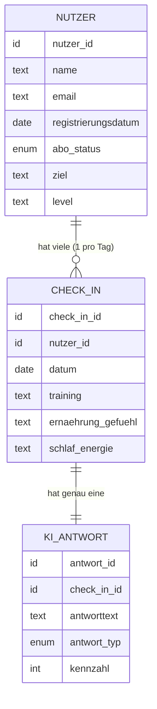

# Datenmodell (Grobkonzept)

Jeder [[Nutzer]] hat viele [[Check-ins]], jeder Check-in hat genau eine [[KI-Antworten|KI-Antwort]]. Der [[Fortschritts-Verlauf]] wird aus den Bewertungs-Kennzahlen aller KI-Antworten eines Nutzers gebildet und braucht keine eigene Tabelle.

## Tabellen

1. [[Nutzer]]
2. [[Check-ins]]
3. [[KI-Antworten]]
4. [[Fortschritts-Verlauf]] (abgeleitet, keine Tabelle)

## Bewusst weggelassen

Keine Lebensmittel- oder Übungsdatenbank, keine Kalorien-/Makro-Felder. Das passt zum conversationellen, einfachen Ansatz statt detailliertem All-in-one-Tracking (siehe [[Technischer Ansatz]]).
