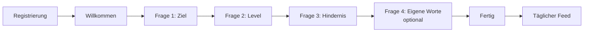

# Onboarding-Fragebogen

Zweiter Baustein im [[MVP-Fortschritt]]. Grundidee aus [[Kernmechanik#1. Onboarding]]: Ein kurzer Fragebogen direkt nach der Registrierung, damit die KI vom ersten Tag an weiß, worum es dem Nutzer geht. Die Antworten landen beim [[Nutzer]].

**Leitlinien:** höchstens 5 Fragen, ein Tipp pro Antwort, auf dem Handy ohne Scrollen bedienbar, unter einer Minute.

## Ablauf auf einen Blick



Vier Fragen, davon drei mit festen Antworten (ein Tipp = Antwort gespeichert und weiter) und eine freie, überspringbare Frage. Das passt zum conversationellen Stil der App, siehe [[App-Konzept]].

## Die Bildschirme im Wortlaut

### Bildschirm 0: Willkommen

- **Überschrift:** Schön, dass du da bist!
- **Text:** Bevor es losgeht, vier kurze Fragen. So kann dein Coach dir von Anfang an Tipps geben, die wirklich zu dir passen. Dauert keine Minute.
- **Button:** Los geht's

### Bildschirm 1: Ziel

- **Oben klein:** Frage 1 von 4
- **Frage:** Was ist dein wichtigstes Ziel?
- **Untertitel:** Wähle das, was dir gerade am meisten am Herzen liegt.

| Button-Text | Speicherwert | Feld |
|---|---|---|
| Muskeln aufbauen | `muskelaufbau` | `ziel` |
| Mehr Energie im Alltag | `energie` | `ziel` |
| Bessere Routinen entwickeln | `routinen` | `ziel` |
| Insgesamt fitter werden | `fitness` | `ziel` |

### Bildschirm 2: Level

- **Oben klein:** Frage 2 von 4
- **Frage:** Wie aktiv bist du im Moment?
- **Untertitel:** Sei ehrlich, hier gibt es kein Richtig oder Falsch.

| Button-Text | Speicherwert | Feld |
|---|---|---|
| Kaum oder gar nicht | `einsteiger` | `level` |
| 1 bis 2 Mal pro Woche | `gelegentlich` | `level` |
| 3 bis 4 Mal pro Woche | `regelmaessig` | `level` |
| 5 Mal oder öfter pro Woche | `sehr_aktiv` | `level` |

### Bildschirm 3: Ausgangssituation

- **Oben klein:** Frage 3 von 4
- **Frage:** Was hält dich gerade am meisten zurück?
- **Untertitel:** Damit dein Coach weiß, wo er ansetzen kann.

| Button-Text | Speicherwert | Feld |
|---|---|---|
| Zu wenig Zeit | `zeit` | `ausgangssituation` ⚠️ |
| Ich bleibe nicht dran | `motivation` | `ausgangssituation` ⚠️ |
| Ich weiß nicht genau, was richtig ist | `wissen` | `ausgangssituation` ⚠️ |
| Wenig Energie oder schlechter Schlaf | `erholung` | `ausgangssituation` ⚠️ |

### Bildschirm 4: In eigenen Worten (optional)

- **Oben klein:** Frage 4 von 4
- **Frage:** Was möchtest du in drei Monaten anders machen?
- **Untertitel:** Erzähl es in eigenen Worten. Ein Satz reicht.
- **Textfeld-Platzhalter:** z. B. „Morgens fit aufwachen und dreimal die Woche trainieren“
- **Button:** Weiter → speichert den Text in `onboarding_notiz` ⚠️
- **Kleiner Text-Button darunter:** Überspringen

### Bildschirm 5: Fertig

- **Überschrift:** Alles klar, los geht's!
- **Text:** Ab jetzt fragt dich die App einmal am Tag, wie es dir geht. Antworte einfach in eigenen Worten, dein Coach kümmert sich um den Rest.
- **Button:** Zum ersten Check-in

> [!warning] ⚠️ Neue Felder, noch nicht entschieden
> `ziel` und `level` gibt es schon in der Tabelle [[Nutzer]]. Für Frage 3 und 4 wären **zwei neue Felder** nötig: `ausgangssituation` und `onboarding_notiz`. Im aktuellen [[Datenmodell]] sind „Ausgangssituation / Level“ noch ein gemeinsames Feld. Die Entscheidung steht in [[Offene Fragen#Onboarding]]. Bis dahin ist das hier ein Vorschlag.

## Warum Speicherwerte statt Button-Text?

Gespeichert wird ein kurzer, fester Wert (z. B. `muskelaufbau`), nicht der Text auf dem Button. So kannst du die Formulierung später ändern, ohne dass alte Antworten nicht mehr passen. Kleinbuchstaben, keine Umlaute, keine Leerzeichen.

## Wie die KI die Antworten nutzt

Später (Baustein [[Kernmechanik#3. KI-Antwort|KI-Antwort]]) werden die Felder bei jeder Anfrage an die KI mitgeschickt, etwa so:

```
Nutzerprofil:
- Ziel: muskelaufbau
- Level: gelegentlich
- Größtes Hindernis: zeit
- In eigenen Worten: "Morgens fit aufwachen und dreimal die Woche trainieren"
```

Dadurch sind schon die ersten Tipps persönlich, bevor es einen Verlauf aus [[Check-ins]] gibt.

---

## Schritt für Schritt in FlutterFlow

> [!info] Annahme: Firebase
> Diese Anleitung nutzt **Firebase** (Anmeldung + Firestore-Datenbank), weil FlutterFlow das direkt eingebaut hat und es für Einsteiger am einfachsten ist. Ob es dabei bleibt, steht in [[Offene Fragen#Onboarding]]. Menünamen können je nach FlutterFlow-Version leicht abweichen.

### Schritt 0: Voraussetzungen prüfen

1. Links in der Leiste auf **Settings & Integrations** (Zahnrad) → **Firebase**. Dort muss ein Firebase-Projekt verbunden sein. Falls nicht: auf **Connect** klicken und dem Assistenten folgen.
2. Ebenfalls in den Settings → **Authentication**: einschalten, Typ **Firebase**, Anmeldeart **E-Mail**. Als **Logged In Page** die Startseite des Feeds wählen (z. B. `HomePage`).
3. Dabei legt FlutterFlow automatisch die Sammlung **users** an. Das ist unsere Tabelle [[Nutzer]].

### Schritt 1: Felder in der Datenbank anlegen

1. Links auf **Firestore** (Datenbank-Symbol) → Sammlung **users** öffnen.
2. Auf **+ Add Field** klicken und nacheinander anlegen, jeweils Typ **String**:
   - `ziel`
   - `level`
   - `ausgangssituation` (nur wenn die neuen Felder bestätigt sind)
   - `onboarding_notiz` (nur wenn die neuen Felder bestätigt sind)
3. Speichern.

### Schritt 2: Sechs leere Seiten anlegen

1. Links auf **Page Selector** → **+** → **Create Blank Page**.
2. Diese Namen vergeben:
   - `OnboardingStart`
   - `OnboardingZiel`
   - `OnboardingLevel`
   - `OnboardingHindernis`
   - `OnboardingWorte`
   - `OnboardingFertig`

### Schritt 3: Die erste Frageseite bauen (Vorlage)

Auf `OnboardingZiel`:

1. Aus dem **Widget Palette** eine **Column** auf die Seite ziehen. Rechts bei **Padding** überall `24` eintragen.
2. In die Column ziehen, von oben nach unten:
   - **Text** → „Frage 1 von 4“ (klein, z. B. Theme-Stil *Label Medium*)
   - **Progress Bar** (linear) → Wert `0.25` (bei Frage 2: `0.5`, Frage 3: `0.75`, Frage 4: `1.0`)
   - **Text** → „Was ist dein wichtigstes Ziel?“ (groß, *Headline Small*)
   - **Text** → der Untertitel (*Body Medium*)
   - vier **Button**s mit den Button-Texten aus der Tabelle oben
3. Bei jedem Button rechts **Width** auf *infinity* (volle Breite) stellen und zwischen den Buttons etwas Abstand lassen (Column → **Spacing** z. B. `12`).

### Schritt 4: Was beim Tippen passiert (Aktionen)

Für **jeden** der vier Buttons:

1. Button anklicken → rechts das **Actions**-Panel (Blitz-Symbol) → **+ Add Action**.
2. **Backend/Database** → **Firestore** → **Update Document**.
3. Bei **Reference to Update**: **Authenticated User** → **User Reference**.
4. **+ Add Field** → `ziel` wählen → **Value Source: Specific Value** → den Speicherwert eintragen, z. B. `muskelaufbau`.
5. Darunter eine zweite Aktion: **+ Add Action** → **Navigate To** → `OnboardingLevel`.

> [!tip] Zeit sparen
> Wenn `OnboardingZiel` fertig ist: im Page Selector Rechtsklick → **Duplicate** und daraus `OnboardingLevel` und `OnboardingHindernis` machen. Dann nur Texte, Feldname, Speicherwerte, Fortschrittswert und Ziel-Seite ändern.

| Seite | Feld | weiter zu |
|---|---|---|
| `OnboardingZiel` | `ziel` | `OnboardingLevel` |
| `OnboardingLevel` | `level` | `OnboardingHindernis` |
| `OnboardingHindernis` | `ausgangssituation` | `OnboardingWorte` |

### Schritt 5: Die Seite mit eigenen Worten

Auf `OnboardingWorte`:

1. Kopf wie bei den anderen Seiten (Text „Frage 4 von 4“, Progress Bar `1.0`, Frage, Untertitel).
2. Ein **TextField** einfügen. Rechts: **Hint Text** = der Platzhalter-Satz, **Max Lines** = `4`, **Max Length** = `300`.
3. **Button** „Weiter“ → Aktion **Update Document** (wie in Schritt 4) → Feld `onboarding_notiz` → **Value Source: Widget State** → das TextField auswählen. Danach **Navigate To** → `OnboardingFertig`.
4. Darunter ein **TextButton** „Überspringen“ → nur **Navigate To** → `OnboardingFertig`.

### Schritt 6: Start- und Fertig-Seite

- `OnboardingStart`: Überschrift, Text und Button „Los geht's“ → **Navigate To** `OnboardingZiel`.
- `OnboardingFertig`: Überschrift, Text und Button „Zum ersten Check-in“ → **Navigate To** `HomePage`. In dieser Navigate-Aktion **Allow Back Navigation** ausschalten, damit man nicht zurück ins Onboarding wischt.

### Schritt 7: Onboarding nur beim ersten Mal zeigen

Woran die App erkennt, dass jemand neu ist: Das Feld `ziel` ist noch leer. Dafür braucht es kein extra Feld.

1. Seite `HomePage` öffnen → im Actions-Panel oben **On Page Load** wählen → **+ Add Action**.
2. **Add Conditional** → Bedingung: **Authenticated User** → `ziel` → **Is Set and Not Empty**.
3. Im **FALSE**-Zweig: **Navigate To** → `OnboardingStart`, **Allow Back Navigation** aus.
4. Im TRUE-Zweig nichts eintragen.

### Schritt 8: Testen

1. Oben rechts **Test Mode** (Blitz) oder **Run Mode** starten.
2. Mit einer neuen Test-E-Mail registrieren und alle Fragen durchklicken.
3. Prüfen: In der **Firebase-Konsole** → **Firestore Database** → `users` → dein Test-Nutzer sollte jetzt `ziel`, `level` usw. mit den Speicherwerten haben.
4. App neu starten: Das Onboarding darf **nicht** noch einmal erscheinen.

Wenn alles klappt, kann der Punkt im [[MVP-Fortschritt]] abgehakt werden.

## Weiter

- Nächster Baustein: [[Kernmechanik#2. Täglicher Feed (Kernbildschirm)|Täglicher Feed]]
- Offene Punkte: [[Offene Fragen#Onboarding]]
